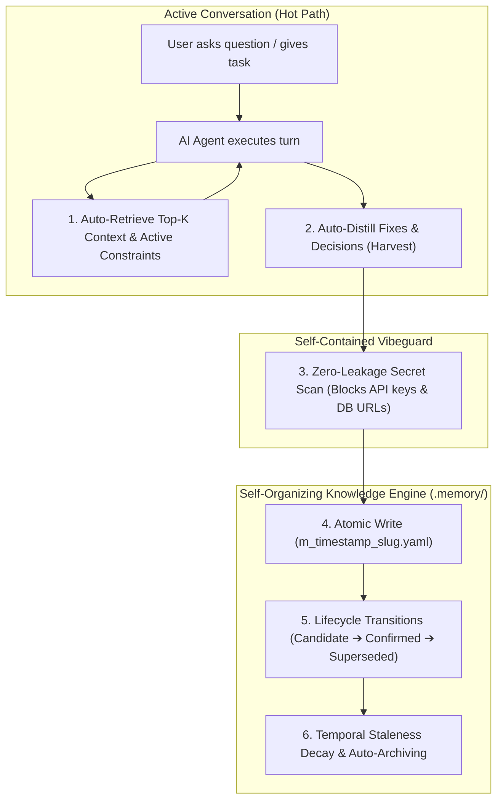

# <h1> 🧠 Muse Memory</h1>

<div align="center">


**Autonomous, Self-Organizing Cognitive Memory System for AI Agents & Agency Networks**

</div>

---

## 💡 What is Muse Memory? (TL;DR)

Most AI chatbots and coding assistants have **"goldfish memory"**: every time you close a chat and start a new one, they forget everything about your project, your habits, and the bugs you solved yesterday.

**Muse Memory gives your AI assistants a persistent, self-organizing notebook directly on your machine.**

- 👤 **Remembers You (`USER.md`)**: Configures your role (developer, designer, marketer, casual) and communication preferences so the AI speaks your language.
- 📐 **Remembers Project Rules (`CURRENT.md`)**: Injects active hard constraints and open loops so agents never break established invariants.
- 🧠 **Learns As You Build**: Automatically captures bug workarounds and architectural decisions, feeding only relevant notes back into future sessions.
- 🔌 **Auto-Connects to 80+ AI Tools**: Single-command setup (`npx musememory install`) wires Claude Code, Cursor, Windsurf, Hermes, OpenCode, and more.
- 🛡️ **100% Private & Daemon-Free**: Pure file-backed storage (`.memory/`) with built-in secret scrubbing (Vibeguard) that prevents API keys or passwords from ever being saved.

---

## ⚡ Architecture & Dual-Scope Storage

- **Primary Command**: `**memory**` (alias: `musememory` or `**npx musememory**`)
- **Zero-Install NPX Execution**: Run directly with `npx musememory <cmd>` or `bunx musememory <cmd>` without needing `npm i -g`.
- **Local Workspace Storage**: `.memory/` (automatically detected in your project root; `.musememory/` supported for backward compatibility)
- **Global System Storage**: `~/.memory/` (available across all directories or explicitly with `--global` / `-g`)
- **Smart Agent Auto-Detection & Clean Connect**: Probes workstation for 80+ coding agents (Claude Code, Cursor, Hermes Agent, OpenCode, OpenClaw, Codex, Gemini, Goose, Continue, Cline, Roo, Pi, Crush, etc.) and wires **ONLY installed agents**, skipping uninstalled ones to keep workspaces clean without generating unneeded folders.
- **Universal Provider Auto-Detection & Migration**: Auto-detects existing memory stores across 24+ formats (`memory detect` / `memory migrate`) with strict state preservation (active ➔ confirmed, archived ➔ superseded, core constraints ➔ `CURRENT.md`).
- **Dynamic Prompt Token Budgeter**: Exact token packing (`--token-budget <N>` / `token_budget` in MCP) for zero-bloat prompt injection.
- **Universal Transcript Ingestion**: Ingest raw `.jsonl` conversation transcripts (`memory import-transcript <file.jsonl>`) from Claude Code, Antigravity, Cursor, and Codex.
- **Operational Audit Ledger**: Append-only compliance log (`.memory/audit.jsonl` / `memory audit`) tracking all memory mutations.

---

## 🚀 Quick Start & Installation

> [!TIP]
>
> ### ⚡ Instant 5-Second Setup (Zero-Install NPX / BunX)
>
> **No global installation required. No package clutter.** Set up your memory system and wire your AI agents with a single command:
>
> ```bash
> npx musememory install
> # (or with Bun: bunx musememory install)
> ```
>
> This one command:
>
> 1. Initializes `.memory/` and `CURRENT.md` in your project folder (or `~/.memory/` with `--global`).
> 2. Auto-detects all installed AI coding agents (Claude Code, Cursor, Antigravity, Windsurf, Codex, Gemini CLI, Hermes Agent, OpenCode, OpenClaw, etc.).
> 3. Auto-wires the memory MCP server into installed agents with zero-permission auto-approval.
> 4. Scans for existing memory stores (AgentMemory, Supermemory, Beads, Mem0, etc.) for instant migration.
>
> **Verify anytime**: `npx musememory doctor`  
> **Query memories**: `npx musememory briefing` or `npx musememory search "auth"`

---

### 📦 Persistent Installation Options

```bash
# Option A: Global Install with NPM or Bun (Recommended)
npm install -g musememory
# or with Bun:
bun add -g musememory

# Option B: One-Line Shell Installer
curl -fsSL https://raw.githubusercontent.com/harshsinghmp/musememory/main/scripts/install.sh | bash

# Option C: Docker Container
git clone https://github.com/harshsinghmp/musememory.git && cd musememory
docker build -t musememory .
```

Once installed, you can run `memory` anywhere:
```bash
memory install          # One-line full workspace & agent configuration
memory doctor           # Comprehensive system health check
memory connect --all    # Auto-wire all detected AI coding agents
memory briefing         # Summarize active knowledge & constraints
```

---

## 🔄 Complete NPX Lifecycle (Install → Verify → Uninstall)

Every command below works with **zero installation** via `npx musememory <cmd>` (or `bunx musememory <cmd>`). Swap in plain `memory <cmd>` if you did a global install.

### 1️⃣ Install & Auto-Wire

```bash
# Full setup: init .memory/, detect agents, wire MCP, scan for migratable stores
npx musememory install

# Initialize a workspace only (no agent wiring)
npx musememory init
```

### 2️⃣ Verify Installation

```bash
# Ecosystem health diagnostic (storage, agents, MCP wiring)
npx musememory doctor

# Smoke-test the store
npx musememory stats
npx musememory briefing
```

### 3️⃣ Connect Agents

```bash
# Scan workstation for 80+ coding agents
npx musememory agents

# Auto-wire all detected agents (zero permissions)
npx musememory connect all

# Wire one specific agent
npx musememory connect claude-code

# Re-wire / repair configs that were edited or deleted
npx musememory connect all --force
```

### 4️⃣ Uninstall (Clean Removal)

```bash
# Preview what would be unwired
npx musememory uninstall --dry-run

# Unwire MCP from all agents (keeps .memory/ data)
npx musememory uninstall

# Unwire AND purge project .memory/ data
npx musememory uninstall --purge

# Remove a persistent global install (if you used Option A above)
npm uninstall -g musememory    # or: bun remove -g musememory
rm -f ~/.local/bin/memory ~/.local/bin/musememory
```

### 🛠️ Troubleshooting

| Symptom | Check | Fix |
|---|---|---|
| `command not found: memory` | You skipped global install, or `~/.local/bin` is not on PATH | Use `npx musememory <cmd>` instead, or add `~/.local/bin` to PATH |
| `npx` hangs or prompts to install | Package not cached yet | Confirm prompt with `y`, or pre-install: `npm install -g musememory` |
| Bun vs npm mismatch / broken binary | `which memory` points at stale symlink | `rm -f ~/.local/bin/memory ~/.local/bin/musememory`, reinstall via npm/bun |
| Agent doesn't show the MCP server | Run `npx musememory doctor` and re-check agent config | `npx musememory connect <agent> --force` to rewrite config |
| MCP configured but tools missing | Agent session started before wiring | Restart the agent session so it reloads MCP config |
| Permission errors during connect/uninstall | Config files owned by another user | Fix ownership of the agent config dir, then retry |
| Store seems empty / wrong scope | You may be in a subdirectory; root detection walks up | Run from project root, or set an explicit dir: `npx musememory stats <dir>` |
| Stale/partial install after upgrade | Old dist cached by npx | Clear npx cache (`npx clear-npx-cache`) or reinstall globally |

---

### Step 2: 100% Permission-Free Multi-Agent Connect

Muse Memory scans your workstation for 80+ coding agents (Claude Code, Cursor, Hermes Agent, OpenCode, OpenClaw, Codex CLI, Gemini CLI, Goose, Continue, Cline, Roo Code, Pi, Crush, etc.) and auto-wires MCP into **only installed agents**, skipping uninstalled ones to keep your filesystem clean:

```bash
# 1. Scan your workstation for 80+ coding agents
memory agents

# 2. Auto-wire all installed agents with zero-permission auto-approval
memory connect --all

# 3. Or wire a specific agent explicitly
memory connect claude-code   # Auto-approves tools in ~/.claude/settings.json
memory connect cursor        # Auto-approves memory in ~/.cursor/mcp.json
memory connect hermes        # Auto-wires MCP in ~/.hermes/config.yaml
memory connect opencode      # Auto-wires local MCP in ~/.config/opencode/opencode.json
memory connect openclaw      # Auto-wires MCP in ~/.openclaw/openclaw.json
memory connect antigravity   # Configures Antigravity CLI MCP
memory connect windsurf      # Configures Windsurf MCP config
memory connect codex         # Configures Codex CLI MCP
memory connect gemini-cli    # Configures Gemini CLI MCP
```

#### 🔹 Manual MCP Configuration (Alternative):

```json
{
  "mcpServers": {
    "memory": {
      "command": "memory",
      "args": ["mcp"]
    }
  }
}
```

---

### Step 3: Zero-Setup Universal Workspace &amp; Global Memory

**Do I need to start Muse Memory manually?**

> **No!** When configured in your MCP settings, your AI IDE / Agent **automatically launches Muse Memory as a background subprocess on agent launch** and stops it when closed. You do not need to run any manual background server or database daemon.

Whenever your AI Agent starts in *any* project folder:

1. `memory` automatically detects or creates a `.memory/` folder in your project (or falls back to `~/.memory/` globally).
2. The AI agent automatically retrieves relevant past fixes and constraints (`get_context`, `memory_recall`).
3. When the AI solves a bug or makes an architectural decision, it distills it into an atomic memory entry (`memory_harvest`, `memory_capture`).
4. You can check what your agents know anytime from your terminal:
  ```bash
   memory briefing
   memory search "authentication redirect"
  
   # Or view global memories
   memory --global briefing
  ```

---

## 🌐 Built-In Visual Dashboard (`memory ui`)

Muse Memory includes a **100% self-contained, zero-dependency visual graph inspector**:

```bash
memory ui
# or specify a custom port
memory ui --port 3000
```

Open `http://localhost:3000` in your browser to:

- 🕸️ Explore the **interactive 2D knowledge graph** connecting decisions, failures, fixes, and dependencies.
- 🔍 Live search and filter memory units by type (`fix`, `decision`, `constraint`, `failure`) and verification level.
- 🚦 Inspect staleness heatmaps and confirm candidate memories with a single click.

---

## ⚡ How Memory Grows, Reloads &amp; Auto-Archives



- **Incremental Auto-Growing**: Every decision, bug fix, operational rule, and session checkpoint is saved as a discrete, human-readable YAML document in `.memory/memories/`.
- **Context Reload Continuity**: On a fresh turn or session restart, `get_context` feeds only the Top-$K$ highest-salience, verified knowledge units—reducing context tokens by **85–95%** and eliminating outdated hallucinations.
- **Smart Archiving &amp; Controlled Forgetting**: Old approaches are marked `superseded` with explicit forward/backward links. Time-based staleness policies (e.g. 30 days for temporary discoveries, 90 days for fixes, 365 days for architecture) automatically down-weight decaying knowledge.

---

## 👤 User Persona & Preferences (`USER.md`) & Setup Wizard

Muse Memory maintains a persistent user profile (`~/.memory/USER.md` globally, or `.memory/USER.md` locally) to ground AI agents in your working style, communication preferences, and toolchain rules.

### 🎭 5 Zero-Fingerprint Role Archetypes

When running `memory install`, an interactive setup wizard configures your primary archetype (or choose one manually anytime):

1. **`developer`** (Default): Code-first, direct, concise, runnable diffs, strict types, fail-fast mechanics.
2. **`designer`**: Visual hierarchy, CSS/Tailwind systems, GSAP animations, WCAG accessibility, Figma/tokens design tokens.
3. **`marketer`**: Conversion-rate optimization (CRO), punchy benefit-driven copy, SEO clustering, audience hooks.
4. **`casual`**: Plain English, jargon-free explanations, step-by-step guidance.
5. **`custom`**: Clean blank template ready for personalized instructions.

```bash
# View active profile
memory user get

# Initialize with a specific archetype
memory user init developer
memory user init designer --global

# Update user profile
memory user set "- Prefers TypeScript, Bun, and ultra terse responses"
```

### 🧠 Prompt Injection Hierarchy & Proactive Self-Nudge
When `get_context` or `formatPromptContext()` builds the LLM prompt context, it structures information deterministically:
1. **`### User Profile & Preferences (USER.md)`** (Tone, role, rules)
2. **`### Active Working Constraints (CURRENT.md)`** (Project invariants & open loops)
3. **`### Relevant Memories & Learned Patterns`** (Top-$K$ ranked memories)
4. **`*Memory Directive: When learning durable facts, bug resolutions, or user preferences, call memory_capture immediately.*`**

---

## 📜 Full-Text Transcript Search with Conversation Bookends

Search across past `.jsonl` transcripts (Claude Code, Cursor, Antigravity, Codex) with surrounding dialogue context windows and session start/end bookends:

```bash
# Search transcript with dialogue window
memory search-transcript "database connection pooling" session.jsonl --window 2 --max 5
```

---

## 🛡️ Built-In Vibeguard Secret Defense (Zero External Dependencies)

`musememory` includes a pure TypeScript, zero-dependency security scanner that protects your repositories:

- **Zero-Leakage Guarantee**: Intercepts OpenAI/Anthropic keys (`sk-*`), GitHub tokens (`ghp_*`), NPM tokens, AWS access keys (`AKIA*`), private key blocks, database connection strings, and plaintext credentials before they can ever be written to disk.
- **100% Standalone**: Does not require any external scripts or system installations.

---

## 🔮 Scope of Work & Roadmap

Every Scope-of-Work item is tracked as a GitHub issue and delivered via pull request. Status: ☐ planned · ◐ in progress · ✅ done. Live status: [issue tracker](https://github.com/harshsinghmp/musememory/issues).

| Status | Item | Tracker |
| :--- | :--- | :--- |
| ✅ | Dynamic Prompt Token Budgeter (`--token-budget N`) — knapsack packing under hard token ceilings | shipped v1.1.0 |
| ✅ | Scene-Based Hierarchical Consolidation (`memory consolidate`) | [#1](https://github.com/harshsinghmp/musememory/issues/1) |
| ☐ | Autonomous Verification Oracle (`memory verify <id>`) | [#2](https://github.com/harshsinghmp/musememory/issues/2) |
| ✅ | Multi-Hop Causality Graph Tracer (`memory trace <id>`) | [#3](https://github.com/harshsinghmp/musememory/issues/3) |
| ✅ | In-Place Core Memory Partitioning (`memory core`) | [#4](https://github.com/harshsinghmp/musememory/issues/4) |
| ☐ | Automated Post-Turn Transcript Harvester Hook | [#5](https://github.com/harshsinghmp/musememory/issues/5) |
| ☐ | Real-Time Agency WebSocket Hub (`memory daemon`) | [#6](https://github.com/harshsinghmp/musememory/issues/6) |
| ☐ | Local Offline Hybrid Vector Engine | [#7](https://github.com/harshsinghmp/musememory/issues/7) |
| ✅ | Delete Deprecated `MemoryStore` Shim *(target: October 2026)* | [#8](https://github.com/harshsinghmp/musememory/issues/8) |
| ☐ | Self-Evolving Skill Distillation | [#9](https://github.com/harshsinghmp/musememory/issues/9) |
| ✅ | 3-Layer Progressive Disclosure | [#10](https://github.com/harshsinghmp/musememory/issues/10) |
| ✅ | Bi-Temporal Reinforcement Feedback | [#11](https://github.com/harshsinghmp/musememory/issues/11) |
| ✅ | Ambient Open-Loop Tracker | [#12](https://github.com/harshsinghmp/musememory/issues/12) |
| ☐ | Knowledge Graph UI v2 | [#13](https://github.com/harshsinghmp/musememory/issues/13) |

---

## 💻 CLI Command Reference

```bash
memory <command> [arguments] [flags]  # alias: musememory
```

| Command             | Arguments / Flags                                                                                      | Description                                                                                                       |
| :------------------- | :------------------------------------------------------------------------------------------------------ | :----------------------------------------------------------------------------------------------------------------- |
| `install`           | `[path] [--global]`                                                                                    | **One-line complete setup**: initializes `.memory/`, `USER.md` profile, and auto-wires all detected coding agents. |
| `doctor`            | `[path] [--global]`                                                                                    | **System diagnostic**: health check for storage, YAML schemas, secrets, MCP connectivity, and audit ledger.       |
| `uninstall`         | `[agent] [--purge] [--dry-run]`                                                                        | **Clean uninstaller**: unwires MCP configuration from coding agents (and optionally purges `.memory/`).           |
| `init`              | `[path] [--legacy] [--global]`                                                                         | Initialize `.memory/` directory (or global `~/.memory/`). Auto-detects existing memories.                         |
| `user`              | `[get\|init\|set] [args] [--global]`                                                                   | Manage `USER.md` persona & preferences across 5 clean archetypes (`developer`, `designer`, `marketer`, etc.).     |
| `connect`           | `[agent] [--all] [--force] [--dry-run]`                                                                | Auto-wire MCP server into detected installed agents (skipping uninstalled ones to keep files clean).              |
| `agents`            | *(none)*                                                                                               | Scan machine for 80+ coding agents (Claude Code, Cursor, Hermes, OpenCode, OpenClaw, Codex, etc.).                |
| `detect`            | *(none)*                                                                                               | Scan workstation and local workspace for existing memory systems across 24+ formats.                              |
| `migrate`           | `[--from P] [--all] [--dry-run] [--overwrite] [--project P]`                                           | Auto-detect and migrate memories into Muse Memory preserving active/archived state & secrets.                     |
| `ui`                | `[--port N] [--global]`                                                                                | Launch zero-dependency visual knowledge graph dashboard.                                                          |
| `context`           | `[query] [--limit N] [--token-budget N] [--project P] [--type T] [--status S] [--verified] [--global]` | Retrieve Top-$K$ ranked active context (with token budget limit).                                                 |
| `search`            | `<query> [--limit N] [--token-budget N] [--include-superseded] [--type T] [--status S] [--global]`     | Ranked token search with scores and status indicators.                                                            |
| `search-transcript` | `<query> [file.jsonl] [--window N] [--max N]`                                                          | Search transcript with dialogue context window and start/end conversation bookends.                               |
| `harvest`           | `<text\|file> --project P [--confirmed] [--global]`                                                    | Distill raw text/transcripts into structured outcome/fix memory units.                                            |
| `import-transcript` | `<file.jsonl\|text> [--project P] [--confirmed] [--global]`                                            | Ingest `.jsonl` session transcript from Claude Code / Antigravity / Cursor into memories (alias: `import-jsonl`). |
| `capture`           | `<text> --project P [--title T] [--tags a,b] [--type T] [--confirmed] [--global]`                      | Fast proposal with inline zero-leakage secret scan.                                                               |
| `propose`           | `<text> --project P [--title T] [--tags a,b] [--type T] [--confirmed] [--global]`                      | Create a candidate memory entry.                                                                                  |
| `recall`            | `<query> [--limit N] [--token-budget N] [--project P] [--type T] [--status S] [--verified] [--global]` | Rich recall displaying verification levels and related graph links.                                               |
| `confirm`           | `<id> [--global]`                                                                                      | Promote `candidate`, `disputed`, or `stale` entry to `confirmed`.                                                 |
| `supersede`         | `<old_id> --with <new_id> [--global]`                                                                  | Mark old entry superseded by new confirmed entry.                                                                 |
| `mark-stale`        | `<id> [--reason <text>] [--global]`                                                                    | Mark an entry stale and append deprecation reason.                                                                |
| `reject`            | `<id> [--global]`                                                                                      | Mark an entry rejected.                                                                                           |
| `delete`            | `<id> [--reason <text>] [--global]`                                                                    | Permanently delete a memory entry and record audit event.                                                         |
| `audit`             | `[--operation OP] [--entry-id ID] [--limit N] [--global]`                                              | Query append-only operational audit trail (`.memory/audit.jsonl`).                                                |
| `link`              | `<id> --related <id1,id2> [--global]`                                                                  | Synchronize bidirectional relation links between entries.                                                         |
| `export`            | `[--out <file.json>] [--global]`                                                                       | Export memory snapshot for agency network sync.                                                                   |
| `import`            | `<file.json> [--overwrite] [--global]`                                                                 | Import and validate memory snapshot into local store.                                                             |
| `list` / `ls`       | `[--status S] [--type T] [--project P] [--global]`                                                     | List memory entries with multi-field status, type, and project filtering.                                         |
| `stats`             | `[--global]`                                                                                           | Display breakdown statistics of total memories, status distribution, and type metrics.                            |
| `briefing`          | `[--limit N] [--global]`                                                                               | Active summary of recent entries, status counts, and recurring due items.                                         |
| `stale`             | `[--days N] [--global]`                                                                                | Audit active entries exceeding per-type staleness policies.                                                       |
| `session`           | `start --project P [--note T]` / `end <id>`                                                            | Record session start/end timeline nodes.                                                                          |
| `current`           | `get` / `set <text> --project P`                                                                       | Read or append hard constraints to `.memory/CURRENT.md`.                                                          |
| `graph`             | `status`                                                                                               | Query active CodeGraph provider status.                                                                           |
| `mcp`               | *(none)*                                                                                               | Start stdio MCP server.                                                                                           |


---

## 🔌 MCP Server Tools

When registered as an MCP server, `musememory` exposes the following tools to any AI model:


| MCP Tool                    | Description                                                                                         |
| :-------------------------- | :--------------------------------------------------------------------------------------------------- |
| `get_context`               | Fetches Top-$K$ ranked memories tailored for active prompt injection with optional `token_budget`.  |
| `search`                    | Searches memory units with query, token budget, project, type, and verification filters.            |
| `memory_get_user_profile`   | Reads the active user persona and preferences (`USER.md`).                                          |
| `memory_set_user_profile`   | Updates `USER.md` persona and preferences with inline secret defense.                               |
| `memory_search_transcripts` | Full-text search over past `.jsonl` transcripts with conversation bookends and context window.      |
| `memory_detect_agents`      | Scans machine for 80+ coding agents (Claude Code, Cursor, Hermes, OpenCode, OpenClaw, Codex, etc.). |
| `memory_connect`            | Auto-wires MCP into installed agents or a specified agent with zero permissions.                    |
| `memory_detect_providers`   | Scans workspace and machine for external memory formats (24+ providers).                            |
| `memory_migrate`            | Migrates memories from detected providers with state preservation and secret scrubbing.             |
| `memory_harvest`            | Distills conversation turns into structured fix/outcome units.                                      |
| `memory_import_transcript`  | Ingests JSONL transcripts into structured memory units.                                             |
| `memory_capture`            | Saves memory with strict inline secret scanning.                                                    |
| `memory_recall`             | Rich inspection of knowledge units, verification, relations, and token budgeting.                   |
| `memory_confirm`            | Promotes candidate or stale memories to confirmed status.                                           |
| `memory_supersede`          | Supersedes outdated knowledge with a confirmed target.                                              |
| `memory_link`               | Connects related memory units bidirectionally.                                                      |
| `memory_mark_stale`         | Flags decaying knowledge units.                                                                     |
| `memory_reject`             | Marks rejected or refuted hypotheses.                                                               |
| `memory_delete`             | Permanently deletes a memory unit and logs audit record.                                            |
| `memory_audit`              | Queries the append-only operational audit ledger.                                                   |
| `memory_export`             | Exports full memory snapshot JSON.                                                                  |
| `memory_import`             | Imports validated memories from a snapshot.                                                         |
| `memory_validate`           | Audits store integrity and detects credential leaks.                                                |
| `graph_status`              | Inspects CodeGraph AST integration status.                                                          |


---

## 🧹 Uninstallation & Complete Cleanup

If you wish to export your knowledge base, unwire MCP connections, or completely remove Muse Memory from your machine:

### Step 1: Export Your Memories (Recommended Backup)
Export a portable JSON snapshot before removing data:
```bash
# Export local workspace memories
memory export --out my-memories-backup.json

# Or export global system memories
memory export --global --out global-memories-backup.json
```

### Step 2: Unwire MCP from Coding Agents
Unwire the Muse Memory MCP server from all configured AI coding agents (Claude Code, Cursor, Hermes, OpenCode, Codex, etc.):
```bash
# Dry-run inspection
memory uninstall --dry-run

# Unwire MCP configurations without touching memory files
memory uninstall

# Unwire a specific agent only
memory uninstall claude-code
```

### Step 3: Complete Removal & Data Purge
```bash
# Unwire MCP agents AND purge the project .memory/ directory
memory uninstall --purge

# Remove storage directories
rm -rf .memory/           # Local workspace store
rm -rf ~/.memory/         # Global system store

# Uninstall global binaries/packages
npm uninstall -g musememory
# or with Bun:
bun remove -g musememory
# or remove fallback symlinks
rm -f ~/.local/bin/memory ~/.local/bin/musememory
```

---

## 🧪 Testing & Verification

```bash
bun install
bun test          # 128 tests passing across 22 test suites
bunx tsc --noEmit # 0 type errors
bun run build     # Clean bundled distribution build (dist/index.js)
```

---

## 📜 License

MIT License. Designed for the AI Developer Ecosystem.