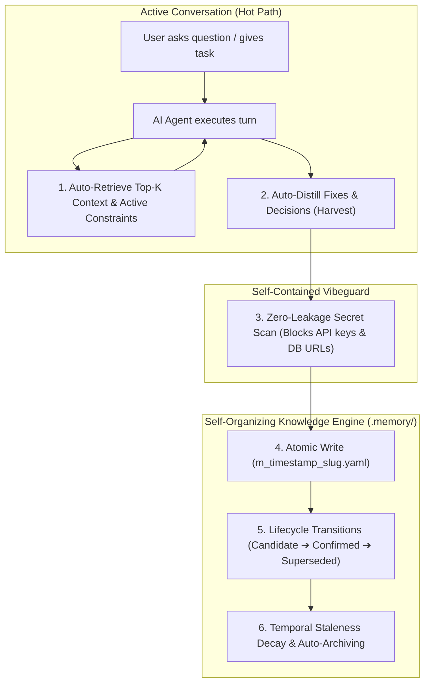

# 🧠 Muse Memory

<div align="center">

[](https://github.com/harshsinghmp/musememory/releases)
[](https://www.npmjs.com/package/musememory)
[](https://bun.sh)
[](https://modelcontextprotocol.io/)
[](test/)
[](Dockerfile)
[](LICENSE)

**Autonomous, Self-Organizing Cognitive Memory System for AI Agents & Agency Networks**

</div>

---

## ⚡ Architecture & Dual-Scope Storage

- **Primary Command**: **`memory`** (alias: `musememory` or **`npx musememory`**)
- **Zero-Install NPX Execution**: Run directly with `npx musememory <cmd>` or `bunx musememory <cmd>` without needing `npm i -g`.
- **Local Workspace Storage**: `.memory/` (automatically detected in your project root; `.musememory/` supported for backward compatibility)
- **Global System Storage**: `~/.memory/` (available across all directories or explicitly with `--global` / `-g`)
- **Smart Agent Auto-Detection & Clean Connect**: Probes workstation for 80+ coding agents (Claude Code, Cursor, Hermes Agent, OpenCode, OpenClaw, Codex, Gemini, Goose, Continue, Cline, Roo, Pi, Crush, etc.) and wires **ONLY installed agents**, skipping uninstalled ones to keep workspaces clean without generating unneeded folders.
- **Universal Provider Auto-Detection & Migration**: Auto-detects existing memory stores across 24+ formats (`memory detect` / `memory migrate`) with strict state preservation (active ➔ confirmed, archived ➔ superseded, core constraints ➔ `CURRENT.md`).
- **Dynamic Prompt Token Budgeter**: Exact token packing (`--token-budget <N>` / `token_budget` in MCP) for zero-bloat prompt injection.
- **Universal Transcript Ingestion**: Ingest raw `.jsonl` conversation transcripts (`memory import-transcript <file.jsonl>`) from Claude Code, Antigravity, Cursor, and Codex.
- **Operational Audit Ledger**: Append-only compliance log (`.memory/audit.jsonl` / `memory audit`) tracking all memory mutations.

---

## 🚀 Quick Start & Installation

> [!TIP]
> ### ⚡ Instant 5-Second Setup (Zero-Install NPX / BunX)
> **No global installation required. No package clutter.** Set up your memory system and wire your AI agents with a single command:
> ```bash
> npx musememory install
> # (or with Bun: bunx musememory install)
> ```
> This one command:
> 1. Initializes `.memory/` and `CURRENT.md` in your project folder (or `~/.memory/` with `--global`).
> 2. Auto-detects all installed AI coding agents (Claude Code, Cursor, Antigravity, Windsurf, Codex, Gemini CLI, Hermes Agent, OpenCode, OpenClaw, etc.).
> 3. Auto-wires the memory MCP server into installed agents with zero-permission auto-approval.
> 4. Scans for existing memory stores (AgentMemory, Supermemory, Beads, Mem0, etc.) for instant migration.
>
> **Verify anytime**: `npx musememory doctor`  
> **Query memories**: `npx musememory briefing` or `npx musememory search "auth"`

---

### 📦 Persistent Global Installation Options

If you prefer having the `memory` and `musememory` CLI commands permanently available in your `$PATH`, choose your favorite package manager:

```bash
# Option A: Bun Global (Instantaneous sub-millisecond execution)
bun add -g musememory
# (or from GitHub: bun add -g github:harshsinghmp/musememory)

# Option B: NPM Global
npm install -g musememory
# (or from GitHub: npm install -g github:harshsinghmp/musememory)

# Option C: One-Line Shell Installer (Auto-detects Bun or Node)
curl -fsSL https://raw.githubusercontent.com/harshsinghmp/musememory/main/scripts/install.sh | bash

# Option D: Local Repository Link (If cloned locally)
cd musememory && bun link  # or npm link

# Option E: Docker
docker build -t musememory .
```

Once installed globally, you can run `memory` anywhere:
```bash
memory install          # One-line full workspace & agent configuration
memory doctor           # Comprehensive system health check
memory connect --all    # Auto-wire all detected AI coding agents
memory briefing         # Summarize active knowledge & constraints
```

---

### Step 2: 100% Permission-Free Multi-Agent Connect

Muse Memory scans your workstation for 80+ coding agents (Claude Code, Cursor, Hermes Agent, OpenCode, OpenClaw, Codex CLI, Gemini CLI, Goose, Continue, Cline, Roo Code, Pi, Crush, etc.) and auto-wires MCP into **only installed agents**, skipping uninstalled ones to keep your filesystem clean:

```bash
# 1. Scan your workstation for 80+ coding agents
memory agents

# 2. Auto-wire all installed agents with zero-permission auto-approval
memory connect --all

# 3. Or wire a specific agent explicitly
memory connect claude-code   # Auto-approves tools in ~/.claude/settings.json
memory connect cursor        # Auto-approves memory in ~/.cursor/mcp.json
memory connect hermes        # Auto-wires MCP in ~/.hermes/config.yaml
memory connect opencode      # Auto-wires local MCP in ~/.config/opencode/opencode.json
memory connect openclaw      # Auto-wires MCP in ~/.openclaw/openclaw.json
memory connect antigravity   # Configures Antigravity CLI MCP
memory connect windsurf      # Configures Windsurf MCP config
memory connect codex         # Configures Codex CLI MCP
memory connect gemini-cli    # Configures Gemini CLI MCP
```

#### 🔹 Manual MCP Configuration (Alternative):
```json
{
  "mcpServers": {
    "memory": {
      "command": "memory",
      "args": ["mcp"]
    }
  }
}
```

---

### Step 3: Zero-Setup Universal Workspace & Global Memory

**Do I need to start Muse Memory manually?**
> **No!** When configured in your MCP settings, your AI IDE / Agent **automatically launches Muse Memory as a background subprocess on agent launch** and stops it when closed. You do not need to run any manual background server or database daemon.

Whenever your AI Agent starts in *any* project folder:
1. `memory` automatically detects or creates a `.memory/` folder in your project (or falls back to `~/.memory/` globally).
2. The AI agent automatically retrieves relevant past fixes and constraints (`get_context`, `memory_recall`).
3. When the AI solves a bug or makes an architectural decision, it distills it into an atomic memory entry (`memory_harvest`, `memory_capture`).
4. You can check what your agents know anytime from your terminal:
   ```bash
   memory briefing
   memory search "authentication redirect"
   
   # Or view global memories
   memory --global briefing
   ```

---

## 🌐 Built-In Visual Dashboard (`memory ui`)

Muse Memory includes a **100% self-contained, zero-dependency visual graph inspector**:

```bash
memory ui
# or specify a custom port
memory ui --port 3000
```

Open `http://localhost:3000` in your browser to:
- 🕸️ Explore the **interactive 2D knowledge graph** connecting decisions, failures, fixes, and dependencies.
- 🔍 Live search and filter memory units by type (`fix`, `decision`, `constraint`, `failure`) and verification level.
- 🚦 Inspect staleness heatmaps and confirm candidate memories with a single click.

---

## ⚡ How Memory Grows, Reloads & Auto-Archives



- **Incremental Auto-Growing**: Every decision, bug fix, operational rule, and session checkpoint is saved as a discrete, human-readable YAML document in `.memory/memories/`.
- **Context Reload Continuity**: On a fresh turn or session restart, `get_context` feeds only the Top-$K$ highest-salience, verified knowledge units—reducing context tokens by **85–95%** and eliminating outdated hallucinations.
- **Smart Archiving & Controlled Forgetting**: Old approaches are marked `superseded` with explicit forward/backward links. Time-based staleness policies (e.g. 30 days for temporary discoveries, 90 days for fixes, 365 days for architecture) automatically down-weight decaying knowledge.

---

## 🛡️ Built-In Vibeguard Secret Defense (Zero External Dependencies)

`musememory` includes a pure TypeScript, zero-dependency security scanner that protects your repositories:
- **Zero-Leakage Guarantee**: Intercepts OpenAI/Anthropic keys (`sk-*`), GitHub tokens (`ghp_*`), NPM tokens, AWS access keys (`AKIA*`), private key blocks, database connection strings, and plaintext credentials before they can ever be written to disk.
- **100% Standalone**: Does not require any external scripts or system installations.

---

## 💻 CLI Command Reference

```bash
memory <command> [arguments] [flags]  # alias: musememory
```

| Command | Arguments / Flags | Description |
| :--- | :--- | :--- |
| `install` | `[path] [--global]` | **One-line complete setup**: initializes `.memory/` and auto-wires all detected installed coding agents. |
| `doctor` | `[path] [--global]` | **System diagnostic**: health check for storage, YAML schemas, secrets, MCP connectivity, and audit ledger. |
| `uninstall` | `[agent] [--purge] [--dry-run]` | **Clean uninstaller**: unwires MCP configuration from coding agents (and optionally purges `.memory/`). |
| `init` | `[path] [--legacy] [--global]` | Initialize `.memory/` directory (or global `~/.memory/`). Auto-detects existing memories. |
| `connect` | `[agent] [--all] [--force] [--dry-run]` | Auto-wire MCP server into detected installed agents (skipping uninstalled ones to keep files clean). |
| `agents` | *(none)* | Scan machine for 80+ coding agents (Claude Code, Cursor, Hermes, OpenCode, OpenClaw, Codex, etc.). |
| `detect` | *(none)* | Scan workstation and local workspace for existing memory systems across 24+ formats. |
| `migrate` | `[--from P] [--all] [--dry-run] [--overwrite] [--project P]` | Auto-detect and migrate memories into Muse Memory preserving active/archived state & secrets. |
| `ui` | `[--port N] [--global]` | Launch zero-dependency visual knowledge graph dashboard. |
| `context` | `[query] [--limit N] [--token-budget N] [--project P] [--type T] [--status S] [--verified] [--global]` | Retrieve Top-$K$ ranked active context (with token budget limit). |
| `search` | `<query> [--limit N] [--token-budget N] [--include-superseded] [--type T] [--status S] [--global]` | Ranked token search with scores and status indicators. |
| `harvest` | `<text\|file> --project P [--confirmed] [--global]` | Distill raw text/transcripts into structured outcome/fix memory units. |
| `import-transcript`| `<file.jsonl\|text> [--project P] [--confirmed] [--global]` | Ingest `.jsonl` session transcript from Claude Code / Antigravity / Cursor into memories (alias: `import-jsonl`). |
| `capture` | `<text> --project P [--title T] [--tags a,b] [--type T] [--confirmed] [--global]` | Fast proposal with inline zero-leakage secret scan. |
| `propose` | `<text> --project P [--title T] [--tags a,b] [--type T] [--confirmed] [--global]` | Create a candidate memory entry. |
| `recall` | `<query> [--limit N] [--token-budget N] [--project P] [--type T] [--status S] [--verified] [--global]` | Rich recall displaying verification levels and related graph links. |
| `confirm` | `<id> [--global]` | Promote `candidate`, `disputed`, or `stale` entry to `confirmed`. |
| `supersede` | `<old_id> --with <new_id> [--global]` | Mark old entry superseded by new confirmed entry. |
| `mark-stale` | `<id> [--reason <text>] [--global]` | Mark an entry stale and append deprecation reason. |
| `reject` | `<id> [--global]` | Mark an entry rejected. |
| `delete` | `<id> [--reason <text>] [--global]` | Permanently delete a memory entry and record audit event. |
| `audit` | `[--operation OP] [--entry-id ID] [--limit N] [--global]` | Query append-only operational audit trail (`.memory/audit.jsonl`). |
| `link` | `<id> --related <id1,id2> [--global]` | Synchronize bidirectional relation links between entries. |
| `export` | `[--out <file.json>] [--global]` | Export memory snapshot for agency network sync. |
| `import` | `<file.json> [--overwrite] [--global]` | Import and validate memory snapshot into local store. |
| `validate` | `[--dry-run] [--global]` | Deep audit of schemas, secrets, broken links, and referential integrity. |
| `briefing` | `[--limit N] [--global]` | Active summary of recent entries, status counts, and recurring due items. |
| `stale` | `[--days N] [--global]` | Audit active entries exceeding per-type staleness policies. |
| `session` | `start --project P [--note T]` / `end <id>` | Record session start/end timeline nodes. |
| `current` | `get` / `set <text> --project P` | Read or append hard constraints to `.memory/CURRENT.md`. |
| `graph` | `status` | Query active CodeGraph provider status. |
| `mcp` | *(none)* | Start stdio MCP server. |

---

## 🔌 MCP Server Tools

When registered as an MCP server, `musememory` exposes the following tools to any AI model:

| MCP Tool | Description |
| :--- | :--- |
| `get_context` | Fetches Top-$K$ ranked memories tailored for active prompt injection with optional `token_budget`. |
| `search` | Searches memory units with query, token budget, project, type, and verification filters. |
| `memory_detect_agents` | Scans machine for 80+ coding agents (Claude Code, Cursor, Hermes, OpenCode, OpenClaw, Codex, etc.). |
| `memory_connect` | Auto-wires MCP into installed agents or a specified agent with zero permissions. |
| `memory_detect_providers` | Scans workspace and machine for external memory formats (24+ providers). |
| `memory_migrate` | Migrates memories from detected providers with state preservation and secret scrubbing. |
| `memory_harvest` | Distills conversation turns into structured fix/outcome units. |
| `memory_import_transcript` | Ingests JSONL transcripts into structured memory units. |
| `memory_capture` | Saves memory with strict inline secret scanning. |
| `memory_recall` | Rich inspection of knowledge units, verification, relations, and token budgeting. |
| `memory_confirm` | Promotes candidate or stale memories to confirmed status. |
| `memory_supersede`| Supersedes outdated knowledge with a confirmed target. |
| `memory_link` | Connects related memory units bidirectionally. |
| `memory_mark_stale`| Flags decaying knowledge units. |
| `memory_reject` | Marks rejected or refuted hypotheses. |
| `memory_delete` | Permanently deletes a memory unit and logs audit record. |
| `memory_audit` | Queries the append-only operational audit ledger. |
| `memory_export` | Exports full memory snapshot JSON. |
| `memory_import` | Imports validated memories from a snapshot. |
| `memory_validate` | Audits store integrity and detects credential leaks. |
| `graph_status` | Inspects CodeGraph AST integration status. |

---

## 🧪 Testing & Verification

```bash
bun install
bun test          # 107 tests passing across 19 test suites
bunx tsc --noEmit # 0 type errors
```

---

## 📜 License

MIT License. Designed for the AI Developer Ecosystem.
