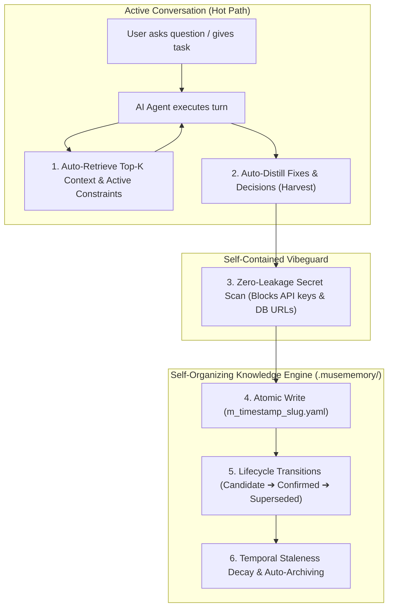

# 🧠 Muse Memory

<div align="center">

[](https://github.com/name/musememory/releases)
[](https://www.npmjs.com/package/musememory)
[](https://bun.sh)
[](https://modelcontextprotocol.io/)
[](test/)
[](Dockerfile)
[](LICENSE)

**Autonomous, Self-Organizing Cognitive Memory System for AI Agents & Agency Networks**

*Brand: **Muse Memory** · Infra: **musememory** · Primary Command: **`memory`** (alias: `musememory`)*

</div>

---

## ⚡ Naming & Command Architecture

- **Brand Name**: **Muse Memory**
- **Infrastructure / Package / Directory**: `musememory` / `.musememory/`
- **Primary Fast CLI Command**: **`memory`** (e.g. `memory search`, `memory context`, `memory ui`, `memory briefing`)
- **Conflict-Safe Command Alias**: **`musememory`** (available if any conflicting tool claims `memory`)

---

## 🚀 Quick Run-Down for Non-Technical Users

You want your AI coding agents (in Cursor, Claude Desktop, Windsurf, OpenCode, Cline, or Antigravity) to **remember what they did across conversations**, stop making the same mistakes, and maintain project decisions—without managing complex vector databases or cloud servers.

Here is the 3-step setup:

```
┌───────────────────────────┐      ┌───────────────────────────┐      ┌───────────────────────────┐
│ 1. Install (curl/npm/bun) │ ───► │ 2. Add MCP Config         │ ───► │ 3. AI Agent Auto-Remembers│
│ curl, npm, bun, or docker │      │ Paste 5 lines of JSON     │      │ Auto-starts on agent open!│
└───────────────────────────┘      └───────────────────────────┘      └───────────────────────────┘
```

### Step 1: Install `musememory` on your machine

Choose **any one** of these installation methods:

```bash
# Option A: via one-line curl installer (Recommended)
curl -fsSL https://raw.githubusercontent.com/name/musememory/main/scripts/install.sh | bash

# Option B: via npm (Node.js)
npm install -g musememory

# Option C: via Bun (Lightning fast)
bun add -g musememory

# Option D: via Docker
git clone https://github.com/name/musememory.git && cd musememory
docker build -t musememory .
```

---

### Step 2: Connect it to your AI Agent / Editor

Add `memory` to your AI tool's MCP configuration (`claude_desktop_config.json`, Cursor Settings, Windsurf MCP, or Antigravity MCP settings):

#### 🔹 Native Install (curl, npm, or Bun):
```json
{
  "mcpServers": {
    "memory": {
      "command": "memory",
      "args": ["mcp"]
    }
  }
}
```

#### 🐳 Docker Install:
```json
{
  "mcpServers": {
    "memory": {
      "command": "docker",
      "args": [
        "run",
        "-i",
        "--rm",
        "-v",
        "/absolute/path/to/your/project/.musememory:/app/.musememory",
        "musememory",
        "mcp"
      ]
    }
  }
}
```

---

### Step 3: Zero-Setup Universal Workspace Memory

**Do I need to start Muse Memory manually?**
> **No!** When configured in your MCP settings, your AI IDE / Agent **automatically launches Muse Memory as a background subprocess on agent launch** and stops it when closed. You do not need to run any manual background server.

Whenever your AI Agent starts in *any* project folder:
1. `memory` automatically detects or creates a `.musememory/` folder in your project.
2. The AI agent automatically retrieves relevant past fixes and constraints (`get_context`, `memory_recall`).
3. When the AI solves a bug or makes an architectural decision, it distills it into an atomic memory entry (`memory_harvest`, `memory_capture`).
4. You can check what your agents know anytime from your terminal:
   ```bash
   memory briefing
   memory search "authentication redirect"
   ```

---

## 🌐 Built-In Visual Dashboard (`memory ui`)

Muse Memory includes a **100% self-contained, zero-dependency visual graph inspector**:

```bash
memory ui
# or specify a custom port
memory ui --port 3000
```

Open `http://localhost:3000` in your browser to:
- 🕸️ Explore the **interactive 2D knowledge graph** connecting decisions, failures, fixes, and dependencies.
- 🔍 Live search and filter memory units by type (`fix`, `decision`, `constraint`, `failure`) and verification level.
- 🚦 Inspect staleness heatmaps and confirm candidate memories with a single click.

---

## ⚡ How Memory Grows, Reloads & Auto-Archives



- **Incremental Auto-Growing**: Every decision, bug fix, operational rule, and session checkpoint is saved as a discrete, human-readable YAML document in `.musememory/memories/`.
- **Context Reload Continuity**: On a fresh turn or session restart, `get_context` feeds only the Top-$K$ highest-salience, verified knowledge units—reducing context tokens by **85–95%** and eliminating outdated hallucinations.
- **Smart Archiving & Controlled Forgetting**: Old approaches are marked `superseded` with explicit forward/backward links. Time-based staleness policies (e.g. 30 days for temporary discoveries, 90 days for fixes, 365 days for architecture) automatically down-weight decaying knowledge.

---

## 🛡️ Built-In Vibeguard Secret Defense (Zero External Dependencies)

`musememory` includes a pure TypeScript, zero-dependency security scanner that protects your repositories:
- **Zero-Leakage Guarantee**: Intercepts OpenAI/Anthropic keys (`sk-*`), GitHub tokens (`ghp_*`), NPM tokens, AWS access keys (`AKIA*`), private key blocks, database connection strings, and plaintext credentials before they can ever be written to disk.
- **100% Standalone**: Does not require any external scripts or system installations.

---

## 📋 Comprehensive Scope of Work & Implementation Checklist

### 🚀 Implementation Status (Strikethrough = Implemented & Verified)

- [x] ~~**Short Command Interface**: Fast, concise `memory <command>` CLI alongside conflict-safe `musememory <command>` alias.~~
- [x] ~~**Embedded Web Dashboard (`memory ui`)**: 100% zero-dependency Canvas 2D visual knowledge graph inspector and search UI.~~
- [x] ~~**Atomic File Storage Engine**: Safe temp-file + rename atomic YAML storage in `.musememory/` with zero external DB locks.~~
- [x] ~~**Formal Lifecycle State Machine**: Full lifecycle transitions (`candidate` ➔ `confirmed` ➔ `superseded` / `stale` / `disputed` / `rejected`).~~
- [x] ~~**Outcome & Fix Distillation Harvester (`memory harvest`)**: Distills root causes, fixes, decisions, and constraints from chat threads.~~
- [x] ~~**Mathematical Salience & Relevance Ranker**: Bounded scoring: $\text{Applicability} + \text{Status} + \text{Verification} + \text{Graph} + \text{Salience} + \text{Decay}$.~~
- [x] ~~**Vibeguard Zero-Leakage Secret Defense**: Pure TypeScript pre-write scanner blocking 8 credential classes before disk write.~~
- [x] ~~**Deep Referential Store Validator (`memory validate`)**: Audits JSON schemas, broken relation links, supersession pointers, and secrets.~~
- [x] ~~**Provider-Neutral Graph AST Integration**: Detects CodeGraph index and awards capped relevance bonuses for matching symbols.~~
- [x] ~~**Agency Network Snapshot Synchronizer**: Portable JSON snapshot `export` and `import` for cross-machine team synchronization.~~
- [x] ~~**Universal Project Discovery & Auto-Init**: Dynamic upward scan and automatic `.musememory/` workspace bootstrapping.~~
- [x] ~~**Dual Interface Tool Surface**: 19 CLI commands + 13 Model Context Protocol (MCP stdio) tool handlers.~~
- [x] ~~**Multi-Platform Packaging & Distribution**: Verified on one-line curl installer, global npm, Bun native, and Docker containers.~~
- [x] ~~**Automated Test Harness**: 70 tests passing across 11 test suites with 0 TypeScript static type errors.~~
- [ ] **Scene-Based Hierarchical Consolidation (`mem_scenes`)**: Automated background 1-paragraph summary rollups of related memory cells (`memory consolidate`).
- [ ] **Autonomous Verification Oracle (`memory verify <id>`)**: Auto-executes `test_command` in an isolated sandbox, automatically confirming verified code fixes.
- [ ] **Dynamic Prompt Token Budgeter (`--token-budget N`)**: Knapsack packing algorithm delivering 95% token reduction under hard token ceilings.
- [ ] **Multi-Hop Causality Graph Tracer (`memory trace <id>`)**: Recursive graph traversal walking full `decision` ➔ `failure` ➔ `fix` ➔ `superseded` causal pathways.
- [ ] **In-Place Core Memory Partitioning (`memory core`)**: Letta/MemGPT 4-tier model supporting in-place runtime editing of permanent operating guidelines.
- [ ] **Automated Post-Turn Transcript Harvester Hook**: Zero-prompt Git pre-commit and IDE session-end hook that automatically harvests memories.
- [ ] **Real-Time Agency WebSocket Hub (`memory daemon`)**: Live peer-to-peer event notification daemon for multi-developer agency teams.
- [ ] **Local Offline Hybrid Vector Engine**: Zero-cloud local ONNX/WASM embedding model for hybrid semantic + BM25 search at $> 10,000$ memory scale.

---

## 💻 CLI Command Reference

```bash
memory <command> [arguments] [flags]  # alias: musememory
```

| Command | Arguments / Flags | Description |
| :--- | :--- | :--- |
| `init` | `[path]` | Initialize `.musememory/` directory and `CURRENT.md` in workspace. |
| `ui` | `[--port N]` | Launch zero-dependency visual knowledge graph dashboard. |
| `context` | `[query] [--limit N] [--project P] [--type T] [--status S] [--verified]` | Retrieve Top-$K$ ranked active context for prompt injection. |
| `search` | `<query> [--limit N] [--include-superseded] [--type T] [--status S]` | Ranked token search with scores and status indicators. |
| `harvest` | `<text\|file> --project P [--confirmed]` | Distill raw text/transcripts into structured outcome/fix memory units. |
| `capture` | `<text> --project P [--title T] [--tags a,b] [--type T] [--confirmed]` | Fast proposal with inline zero-leakage secret scan. |
| `propose` | `<text> --project P [--title T] [--tags a,b] [--type T] [--confirmed]` | Create a candidate memory entry. |
| `recall` | `<query> [--limit N] [--project P] [--type T] [--status S] [--verified]` | Rich recall displaying verification levels and related graph links. |
| `confirm` | `<id>` | Promote `candidate`, `disputed`, or `stale` entry to `confirmed`. |
| `supersede` | `<old_id> --with <new_id>` | Mark old entry superseded by new confirmed entry. |
| `mark-stale` | `<id> [--reason <text>]` | Mark an entry stale and append deprecation reason. |
| `reject` | `<id>` | Mark an entry rejected. |
| `link` | `<id> --related <id1,id2>` | Synchronize bidirectional relation links between entries. |
| `export` | `[--out <file.json>]` | Export memory snapshot for agency network sync. |
| `import` | `<file.json> [--overwrite]` | Import and validate memory snapshot into local store. |
| `validate` | `[--dry-run]` | Deep audit of schemas, secrets, broken links, and referential integrity. |
| `briefing` | `[--limit N]` | Active summary of recent entries, status counts, and recurring due items. |
| `stale` | `[--days N]` | Audit active entries exceeding per-type staleness policies. |
| `session` | `start --project P [--note T]` / `end <id>` | Record session start/end timeline nodes. |
| `current` | `get` / `set <text> --project P` | Read or append hard constraints to `.musememory/CURRENT.md`. |
| `graph` | `status` | Query active CodeGraph provider status. |
| `mcp` | *(none)* | Start stdio MCP server. |

---

## 🔌 MCP Server Tools

When registered as an MCP server, `musememory` exposes the following tools to any AI model:

| MCP Tool | Description |
| :--- | :--- |
| `get_context` | Fetches Top-$K$ ranked memories tailored for active prompt injection. |
| `search` | Searches memory units with query, project, type, and verification filters. |
| `memory_harvest` | Distills conversation turns into structured fix/outcome units. |
| `memory_capture` | Saves memory with strict inline secret scanning. |
| `memory_recall` | Rich inspection of knowledge units, verification, and relations. |
| `memory_confirm` | Promotes candidate or stale memories to confirmed status. |
| `memory_supersede`| Supersedes outdated knowledge with a confirmed target. |
| `memory_link` | Connects related memory units bidirectionally. |
| `memory_mark_stale`| Flags decaying knowledge units. |
| `memory_reject` | Marks rejected or refuted hypotheses. |
| `memory_export` | Exports full memory snapshot JSON. |
| `memory_import` | Imports validated memories from a snapshot. |
| `memory_validate` | Audits store integrity and detects credential leaks. |
| `graph_status` | Inspects CodeGraph AST integration status. |

---

## 🧪 Testing & Verification

```bash
bun install
bun test          # 70 tests passing across 11 test suites
bunx tsc --noEmit # 0 type errors
```

---

## 📜 License

MIT License. Designed for the AI Developer Ecosystem.
